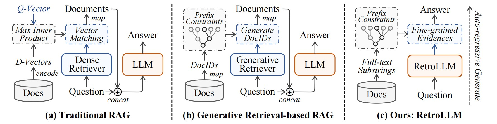
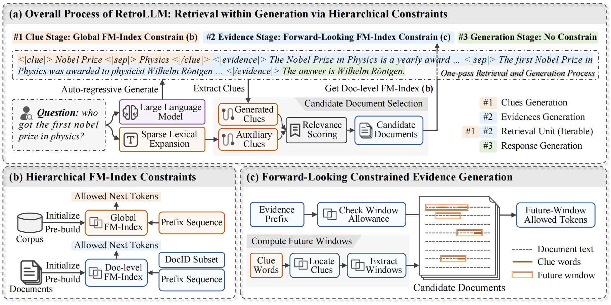

# RetroLLM: Empowering LLMs to Retrieve Fine-grained Evidence within Generation

<div align="center"> 

[](https://arxiv.org/abs/xxxx) [](https://github.com/RUC-NLPIR/GenIR-Survey) [](https://github.com/sunnynexus/RetroLLM/blob/main/LICENSE) [](https://www.python.org/downloads/release/python-390/) 

</div>

## 💡 Overview

Traditional Retrieval-Augmented Generation (RAG) methods rely on separate retrievers for document fetching and often suffer from redundant input tokens for retrieved documents and lack of joint optimization of RAG system. RetroLLM introduces a unified framework that integrates retrieval and generation into a single auto-regressive decoding process, enabling LLMs to directly generate fine-grained evidence from the corpus with FM-Index constrained decoding.


To mitigate false pruning in constrained evidence generation, we propose hierarchical FM-Index constraints to first identify relevant document subsets, and a forward-looking constrained decoding strategy that let the model to be aware of the relevance of future sequences. This approach improves evidence accuracy while significantly reducing input token usage, as we only need to input the question to LLM to perform the entire RAG process.



## 🔧 Installation

### 1. Environment Setup
```bash
# Create conda environment
conda create -n retrollm python=3.9
conda activate retrollm

# Install requirements
pip install -r requirements.txt
```

### 2. Install SWIG
```bash
wget http://prdownloads.sourceforge.net/swig/swig-4.0.2.tar.gz
tar zxvf swig-4.0.2.tar.gz
cd swig-4.2.1
./configure --without-pcre --prefix=YOUR_CODE_DIR
make -j
make install
```

### 3. Build FM-Index Module
```bash
cd RetroLLM
env CFLAGS='-fPIC' CXXFLAGS='-fPIC' scripts/res/external/sdsl-lite/install.sh
swig -c++ -python scripts/seal/cpp_modules/fm_index.i && python setup.py build_ext --inplace
```

## 🏃 Quick Start

### Data Preparation

RetroLLM follows the FlashRAG data format for both training and evaluation. The datasets include:

Training Datasets:
- Natural Questions (NQ)
- TriviaQA
- HotpotQA

Evaluation Datasets:
- Natural Questions (NQ)
- TriviaQA
- HotpotQA
- PopQA
- 2WikiMultiHopQA

Each dataset should be processed following the FlashRAG format specifications. Detailed training scripts coming soon.

### Evaluation

To evaluate the model on the test sets:

1. Edit `scripts/generate.py` to set the correct paths for:
   - Model and checkpoint paths
   - Dataset paths
   - Output directory

2. Run evaluation:
```bash
python scripts/generate.py
```

## Citation
If you find this work helpful, please cite our paper:
```bibtex
@article{retrollm2024,
    title={RetroLLM: Empowering Large Language Models to Retrieve Fine-grained Evidence within Generation},
    author={Xiaoxi Li and
            Jiajie Jin and
            Yujia Zhou and
            Yongkang Wu and
            Zhonghua Li and
            Qi Ye and
            Zhicheng Dou},
    journal={CoRR},
    volume={abs/},
    year={2024},
    url={https://arxiv.org/abs/},
    eprinttype={arXiv},
    eprint={}
}
```

## License
This project is released under the [MIT License](LICENSE).
